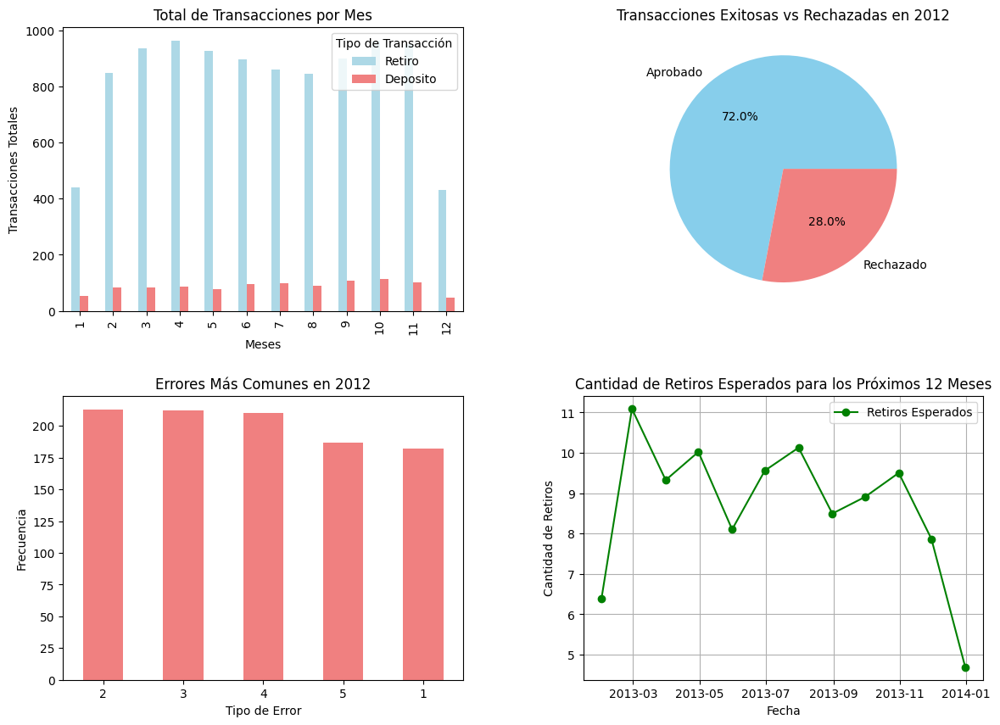

# ATM Transaction Forecasting with Python 📊

## Description

This project leverages Python for comprehensive data analysis and predictive modeling to forecast ATM transaction trends.

Key Highlights:

-Data Analysis: Utilized Pandas to clean, transform, and analyze the transaction dataset, uncovering trends and patterns.

-Visualization: Employed Matplotlib to create clear and insightful charts, enabling better understanding of transaction behaviors over time.

-Forecasting: Implemented the Prophet library for time series forecasting, delivering accurate predictions of future ATM transaction volumes.

This project showcases the power of Python in combining data analysis, visualization, and predictive modeling to solve real-world business challenges.

## Project Structure

The repository contains the following files:

- `backup_AnalisisMonetizacionYoutube.zip`: This file contains the backup to create the database with the tables and populate them.
- `Consultas.sql`: This file contains the SQL queries used to answer the project questions.
- `output_table_example.png`: An example image of the output table for the first question.
